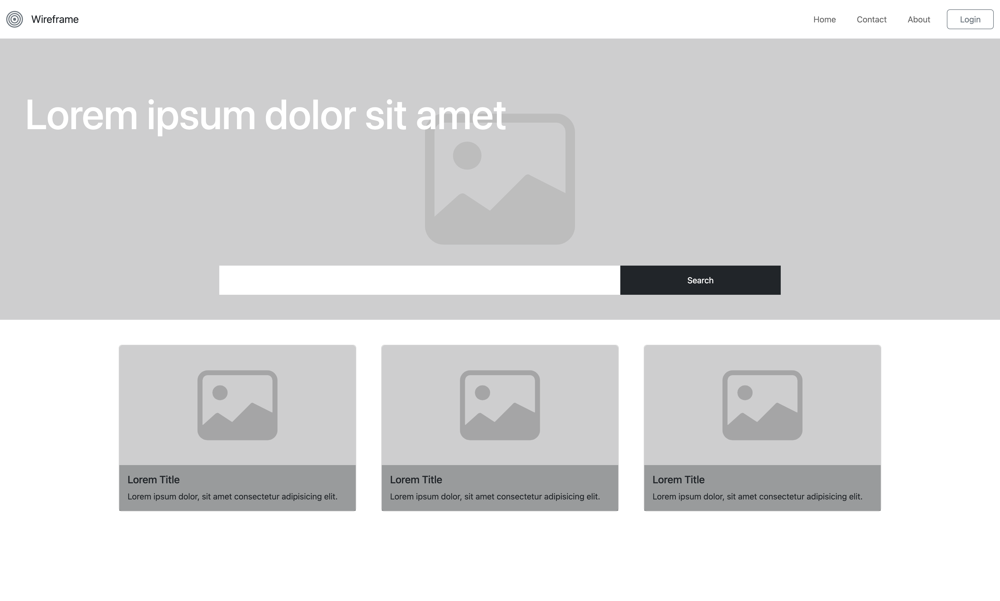

<!-- PROJECT LOGO -->
 

  

<h3 align="center">Mission 0 - Mockup Wireframe and Bootstrap</h3>

  

    Mission 0 is the first project made on Mission Ready DevOps Level 5 Course.
    
  

<!-- ABOUT THE PROJECT -->

## About The Project

That's a project to experiment and try Bootstrap responsiviness and exercise learning through documentation.

### Built With

       

<!-- GETTING STARTED -->

## Getting Started

There's no need to install any package since Bootstrap CDN's have been used on this project.

### Prerequisites

I've used [Live Server](https://marketplace.visualstudio.com/items?itemName=ritwickdey.LiveServer) extension on VS code to run a server for the index.html file. And that's all to it.

### Live Server

After install the [Live Server](https://marketplace.visualstudio.com/items?itemName=ritwickdey.LiveServer) extension. On VS Code, Just open the index.html file and hit the Go Live button on the right bottom corner of the screen.

## How Does it Looks Like

### Desktop

  
  

### Tablet

  
  
  

### Mobile

  
  
  
